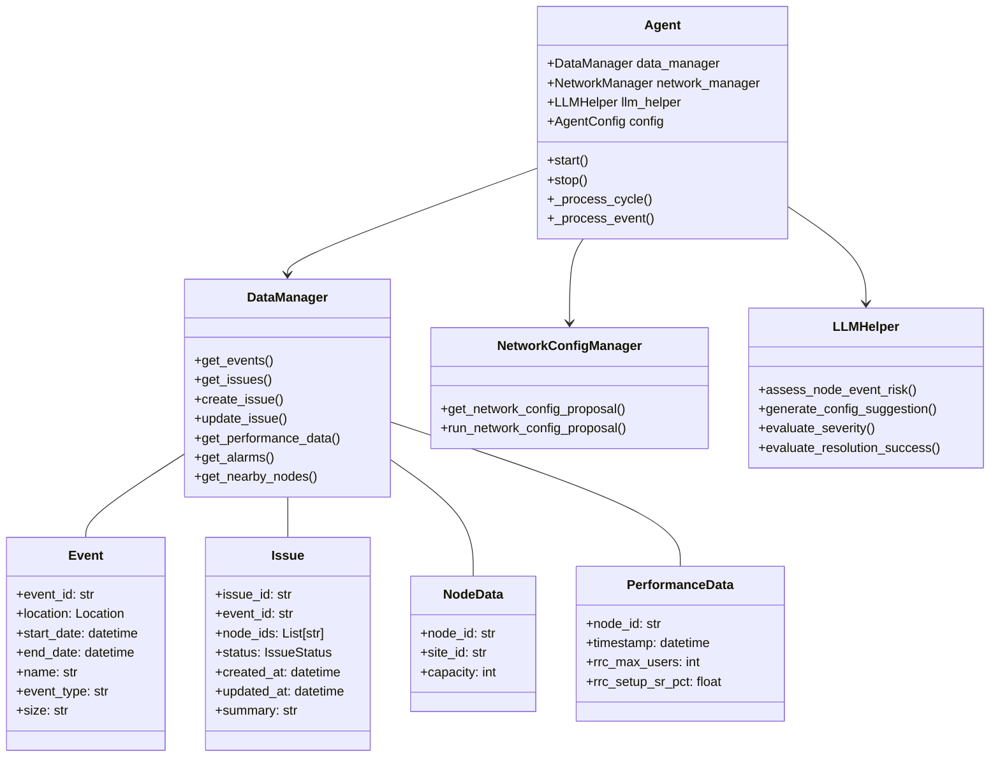

```mermaid
classDiagram
    %% Main Application Classes
    class Agent {
        +DataManager data_manager
        +NetworkManager network_manager
        +LLMHelper llm_helper
        +AgentConfig config
        +start()
        +stop()
        +_process_cycle()
        +_process_event()
    }

    class DataManager {
        +get_events()
        +get_issues()
        +create_issue()
        +update_issue()
        +get_performance_data()
        +get_alarms()
        +get_nearby_nodes()
    }

    class NetworkConfigManager {
        +get_network_config_proposal()
        +run_network_config_proposal()
    }

    class LLMHelper {
        +assess_node_event_risk()
        +generate_config_suggestion()
        +evaluate_severity()
        +evaluate_resolution_success()
    }

    %% Models
    class Event {
        +event_id: str
        +location: Location
        +start_date: datetime
        +end_date: datetime
        +name: str
        +event_type: str
        +size: str
    }

    class Issue {
        +issue_id: str
        +event_id: str
        +node_ids: List[str]
        +status: IssueStatus
        +created_at: datetime
        +updated_at: datetime
        +summary: str
    }

    class NodeData {
        +node_id: str
        +site_id: str
        +capacity: int
    }

    class PerformanceData {
        +node_id: str
        +timestamp: datetime
        +rrc_max_users: int
        +rrc_setup_sr_pct: float
    }

    %% Relationships
    Agent --> DataManager
    Agent --> NetworkConfigManager
    Agent --> LLMHelper
    DataManager -- Event
    DataManager -- Issue
    DataManager -- NodeData
    DataManager -- PerformanceData
```