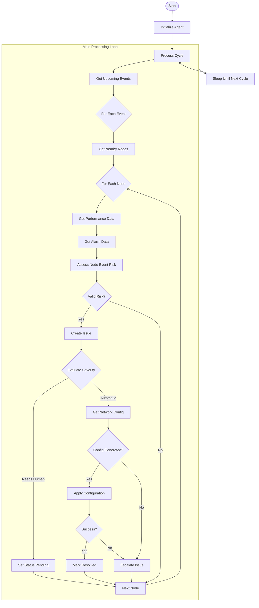

```mermaid
flowchart TB
    Start([Start]) --> Init[Initialize Agent]
    Init --> ProcessCycle[Process Cycle]
    
    subgraph MainLoop[Main Processing Loop]
        ProcessCycle --> GetEvents[Get Upcoming Events]
        GetEvents --> EventLoop{For Each Event}
        EventLoop --> GetNodes[Get Nearby Nodes]
        GetNodes --> NodeLoop{For Each Node}
        
        NodeLoop --> GetPerf[Get Performance Data]
        GetPerf --> GetAlarms[Get Alarm Data]
        GetAlarms --> AssessRisk[Assess Node Event Risk]
        AssessRisk --> ValidRisk{Valid Risk?}
        
        ValidRisk -->|Yes| CreateIssue[Create Issue]
        ValidRisk -->|No| NextNode[Next Node]
        
        CreateIssue --> EvalSeverity{Evaluate Severity}
        EvalSeverity -->|Needs Human| PendingApproval[Set Status Pending]
        EvalSeverity -->|Automatic| GetConfig[Get Network Config]
        
        GetConfig --> ConfigSuccess{Config Generated?}
        ConfigSuccess -->|Yes| ApplyConfig[Apply Configuration]
        ConfigSuccess -->|No| Escalate[Escalate Issue]
        
        ApplyConfig --> Success{Success?}
        Success -->|Yes| Resolved[Mark Resolved]
        Success -->|No| Escalate
        
        NextNode --> NodeLoop
        PendingApproval --> NextNode
        Resolved --> NextNode
        Escalate --> NextNode
    end
    
    MainLoop --> Sleep[Sleep Until Next Cycle]
    Sleep --> ProcessCycle
```