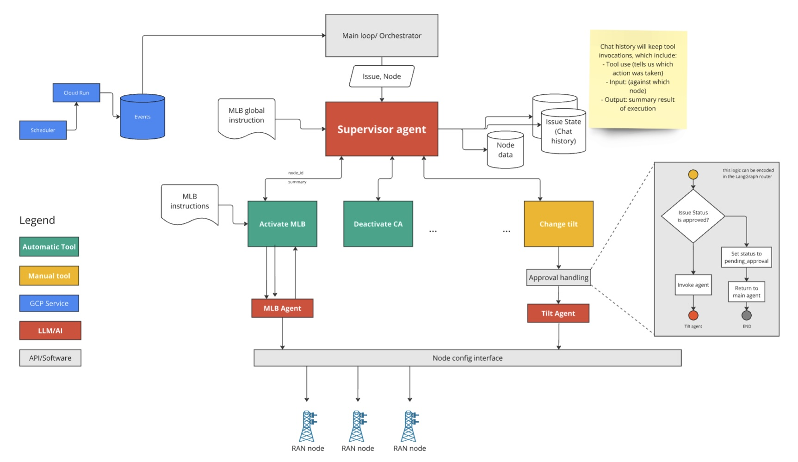

# LLM Agent 
This module implements the agentic AI module of the RAN guardian solution. It consists of a multi-agent workflow where a main, supervisor ("reasoning") agent is responsible for overseeing the overall remediation plan, while other task-specific agents are responsible each for a specific network configuration action (e.g. "activate MLB", "deactivate CA", etc.)

The following diagram illustrates the agent architecture:


The workflow was implemented using LangGraph. 

The LLM model is defined by the environment variable `GEMINI_MODEL_NAME` and defaults to 'gemini-2.0-flash' if not specified. Both supervisor agent and all task-specific agents use the same model. 

## Testing the agent (in isolation)
If you want to run a test end-to-end workflow, run the provided sample code:

```
poetry run python examples/sample_workflow.py
```

You should see the outputs in a log file called `agent.log` in the local directory. 

## Refining agent prompts 
The agent prompts are located in the directory `prompt_templates`. Note: these are just text files but read as jinja templates by the code. If you wish to introduce variables that are dynamically substituted, simply add placeholder names between curly braces, and pass the value for the variable name using the `PromptManager` class.

- Supervisor agent prompt: `prompt_templates/main_agent.prompt`
- Task-specific agent prompts: `prompt_templates/activate_mlb.prompt`, `prompt_templates/deactivate_ca.prompt`, etc.

## Updating tools
There are two types of tools:

- "Task" tools: these are the tools that correspond to a network configuration action (e.g: activate MLB, deactivate CA, etc.)
- "Utility" tools: these are any other tools

The task tools are defined in the `task_agent.py` code file and each tool (action) will run its own LLM agent, which will use the corresponding prompt template. This agent will then use a tool of its own, a generic tool called `run_node_command` (defined in the `tools.py` file along with the other utility tools.)

To change the implementation of a task tool (which is really an agent) you will likely only need to do two things:

1. Update the prompt corresponding to the task.
2. Implement the `run_node_command` function (currently mocked) to actually perform the command specified by the agent. 

This setup assumes a single interface function like `run_node_command` that takes a generic command as input can be used by all task agents. If task agents need different implementations of such an interface, then create additional tools and update the task agent code and prompts accordingly. 


